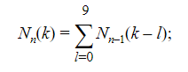

Счастливые билеты

Билет с 2N значным номером считается счастливым,
если сумма N первых цифр равна сумме последних N цифр.
Посчитать, сколько существует счастливых 2N-значных билетов.

Начальные данные: число N от 1 до 10.
Вывод результата: количество 2N-значных счастливых билетов.

в решении предоставлены два подхода:
solver.LuckyTicketsSolver - оптимальное решение, считает N > 10(http://www.ega-math.narod.ru/Quant/Tickets.htm). В данном решении используется формула:

LuckyTicketsSolverBasic - обычное рекурсивное решение, проблемы начинаются с N > 4